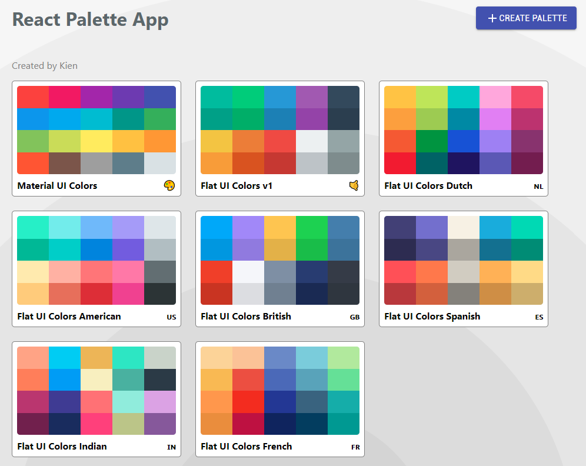

## React Colour Palette Application

A colour application to save different palettes of colours. A slider implementation to change hue throughout each colour and the ability to view a single palette with different levels of shades.

  <a href="https://kien-react-colour-palette.netlify.com/">Live Demo</a>

  

## 👨‍🎓What I learned:

- How to use a React UI framework [Material-UI](https://material-ui.com/)
- Implementation of React Transition Group (CSSTransition)
- Styled with CSS in JS using Material UI's classnames
- How to use third party libraries such as:
  - [Chroma.js](https://gka.github.io/chroma.js/)
  - [Emoji Mart](https://github.com/missive/emoji-mart)
  - [React Sortable HOC](https://github.com/clauderic/react-sortable-hoc)
  - [React Copy to Clipboard](https://github.com/nkbt/react-copy-to-clipboard)
  - [React Form Validator](https://www.npmjs.com/package/react-material-ui-form-validator)
  - [RC Slider](https://www.npmjs.com/package/rc-slider)

## ✍Personal Applications:

- I used a third party Switch react component for my dark mode toggle on my personal blog after being able to see how third party components are utilized
- I added a slider to my personal portfolio to toggle between card view and list view
- I have a better understanding of how data is passed around in React and how it is utilized to make everything work in an application
